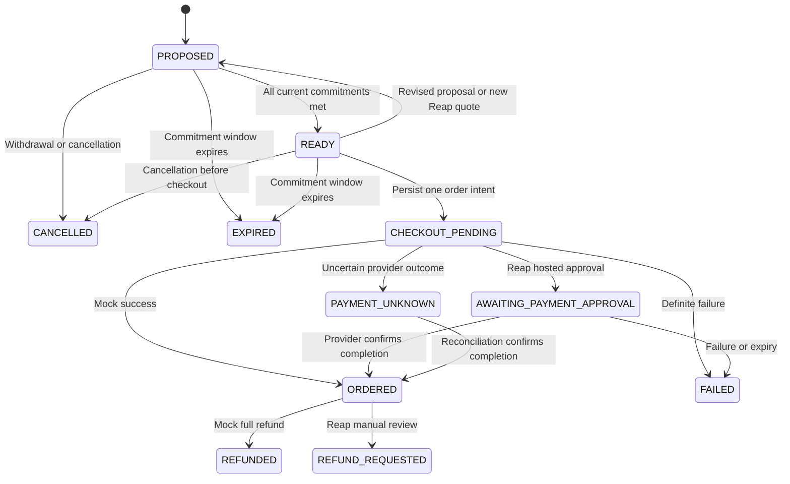

# BookPool — Person 4 backend

Runnable, independent backend for the BookPool team's Telegram bot, merchant intelligence and group optimizer. This component owns the shared records, participant commitments, simulated contribution ledger, checkout orchestration and order lifecycle. It does not implement Persons 1–3's bot, catalogue search or optimizer.

**All transactions are simulated.** Choose local `mock` payments or the actual Reap **sandbox API**. Production Reap hosts are rejected. Reap secrets are intentionally empty in `.env.example`; test card numbers and CVVs are never accepted or stored by BookPool.

## Run locally

Requires Python 3.12 (tested). From this `backend/` directory:

```sh
python3 -m venv .venv
.venv/bin/python -m pip install -r requirements.lock.txt
.venv/bin/python scripts/run_local.py
```

Open http://localhost:8000/docs for interactive Swagger documentation, or http://localhost:8000 for the landing page. The launcher creates `data/bookpool.db` and a private `data/service.key`. In Swagger, pass `Authorization: Bearer <the service key>` in the header field. Do not paste that key into Telegram chats, browser frontend code or GitHub.

In a second terminal:

```sh
.venv/bin/python scripts/demo.py
.venv/bin/python scripts/demo.py --scenario decline
.venv/bin/python scripts/demo.py --scenario timeout
.venv/bin/python scripts/demo.py --scenario refund
.venv/bin/python scripts/demo.py --scenario withdraw
.venv/bin/python -m pytest -q
```

The demo sends requests, offers and proposals through HTTP; no database editing is needed. Alice, Bob and Charlie buy different books. Prices are fictional fixture data, not verified merchant prices. Each run creates a new group. `timeout` demonstrates recovery using the same order; `refund` reconciles mock captures against mock refunds.

## Team integration

Give your teammates the backend URL, a privately shared service key, and [the integration contract](docs/INTEGRATION.md). A small Python client is in `scripts/team_client.py`. Swagger and `docs/openapi.json` define exact request shapes.

| Owner | Sends to backend | Reads from backend |
|---|---|---|
| Person 1 | Users, structured book requests, approvals and mock contribution authorization | Group comparisons, order status and notification events |
| Person 2 | Normalized merchant offers; Reap-resolved variant IDs for Reap mode | Requests needing offers |
| Person 3 | Group proposals, final allocations, delivery plans, recommendation reasons and revisions | Open requests, offers and group status |
| Person 4 | Runs backend/worker, configures database and provider | Payment ledger, pending orders, failures and audit events |

Only the trusted bot server may use its service key to act for Telegram users. Person 1 must map Telegram `callback_query.from_user.id` to the matching backend user; never trust a user ID supplied in callback data alone. Individual backend access tokens are also supported and enforce ownership.

## Lifecycle



`PAYMENT_PENDING` handles other nonterminal provider statuses. `RECONCILIATION_REQUIRED` flags a completed provider charge without a valid reference/amount, or above the agreed total. No new order, cancellation or fabricated refund is allowed while a charge is uncertain.

Prices are integer cents in **SGD**. A proposal must reconcile exactly to the sum of its allocations. Every request must have a fresh, available offer, match the merchant and pickup point, meet its delivery deadline, respect its budget, and beat its best fresh feasible individual offer by its requested minimum saving. The backend rechecks these rules before execution.

Every approval is tied to a version. Revisions and Reap quotes invalidate previous approvals. Mock holds from old proposals are voided and retained in the ledger. Participant withdrawal cancels the pending group and releases requests for Person 3 to regroup.

Database transactions serialize SQLite mutations; PostgreSQL locks protect shared group/request records. A unique order per group and persisted provider idempotency key prevent duplicate checkout creation. Network calls occur after storing the intent. Reap's documented 24-hour idempotency retention is respected: ambiguous intents without a checkout ID are not replayed after 23 hours.

## Add your Reap sandbox key later

Copy `.env.example` to `.env`, leave card fields out, and fill `REAP_API_KEY` privately. Set `PAYMENT_MODE=reap_sandbox`. Use a **fresh database** when switching payment modes; never mix mock authorizations with Reap groups. Set `PAYMENT_RETURN_URL` to an HTTPS return URL, such as `https://t.me/<your_bot_username>` for a local Telegram demo. Restart the server. See [Reap setup and findings](docs/REAP.md).

Reap mode uses one designated purchaser. Other buyers approve allocations but are **not charged** by BookPool. A shared vault, escrow, separate buyer collection, split payment and automatic merchant refunds are not implemented or claimed. The Reap sandbox connector is tested against mocked provider responses; it still needs your sandbox key and a merchant/account smoke test.

## Deployment

For a normal FastAPI host:

```sh
uvicorn app.main:app_factory --factory --host 0.0.0.0 --port 8000
```

Set `BOOKPOOL_SERVICE_API_KEY`, `DATABASE_URL` and `PUBLIC_BASE_URL` in the hosting platform's secret settings. SQLite needs a persistent disk and one service instance; use PostgreSQL for a shared team service. PostgreSQL URLs must start `postgresql+psycopg://`. Table creation runs at startup; schema migration tooling is not included in this hackathon MVP.

`compose.yaml` runs PostgreSQL, the backend and a reconciliation worker. Fill `POSTGRES_PASSWORD` and `BOOKPOOL_SERVICE_API_KEY` in a private `.env`. Use a URL-safe password, because it appears in the database connection URL. Then:

```sh
docker compose up --build -d
```

The backend is bound to localhost by default. Put it behind your hosting platform's HTTPS endpoint for your teammates. Set `BACKEND_URL` and the service key for a separate worker process; run `python scripts/worker.py`. It expires stale groups and polls pending orders every 30 seconds. It scans at most 500 groups; larger deployments need paginated work queues.

The event feed is a durable, cursor-based source for Person 1's notifications. The bot should persist its own cursor, deduplicate by event ID and advance only after successful delivery. BookPool itself does not send Telegram messages or register remote webhooks.

## Practical limits

- SGD and one shared Singapore address per order; no FX, partial fulfillment or partial refunds.
- Mock refunds complete locally; Reap refunds enter manual review without claiming money was returned.
- OpenAPI has no card input fields. API keys and user token hashes are excluded from group/order views.
- A shared service key is an MVP trust boundary, not separate production roles for each teammate.
- Offer correctness, edition/ISBN identity and delivery estimates belong to Person 2. Group matching belongs to Person 3.
- Tests cover local persistence, money rules, identity, concurrency, failures and mocked Reap HTTP behavior. External deployment and a real Reap sandbox merchant transaction need environment credentials.

MIT licensed. The downloaded team repository was empty when inspected; this backend can be merged alongside the other three components.
